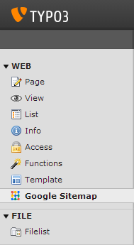
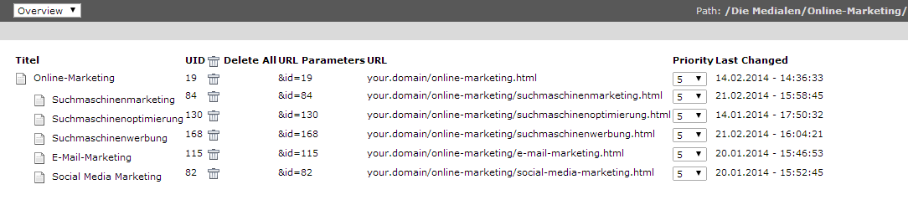

.. ==================================================
.. FOR YOUR INFORMATION
.. --------------------------------------------------
.. -*- coding: utf-8 -*- with BOM.

.. include:: ../Includes.txt

.. _user-manual:

Users Manual
============

Target group: **Editors**

   
This is backend view of TYPO3 after installing "|extension_name|".

After clicking on the |extension_name| module you will see a page listing with the sitemap entries.

   
This is backend view of TYPO3 after the user has clicked on module "|extension_name|".

Here you have an overview of all sitemap entries.
- You can select a page in the "page tree" to filter your selection.
- You can delete all or a single entry.
- You can change the priority for each entry.

.. important::

   Sitemap entries are written to the database only if a page is once requested in the frontend. If your website has a lot of pages and you don't want to open every single one, use a site crawler to crawl the complete site. The same applies if you deleted all sitemap entries. You can use a site crawler like www.xml-sitemaps.com.

Accessing the Sitemap
---------------------

Since this Extension uses the eID mechanism it can be easily accessed by addig the parameter ``eID=dynamicgooglesitemap`` to your site URL. For example: ``http://www.mysite.com/?eID=dynamicgooglesitemap``.